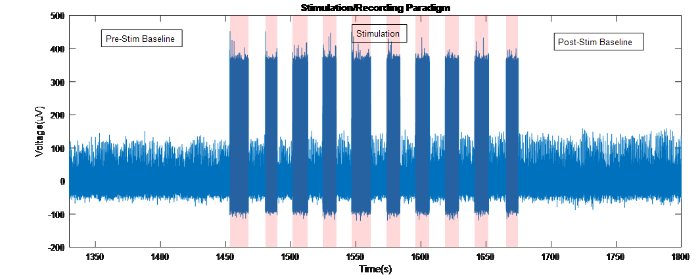
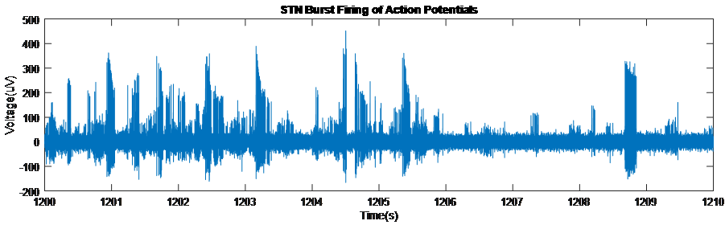
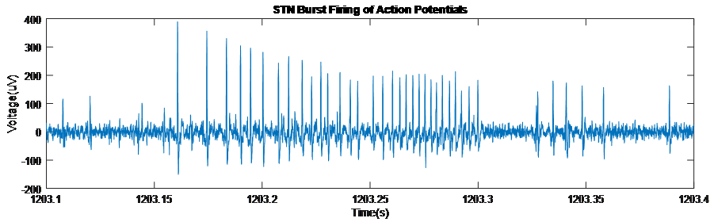
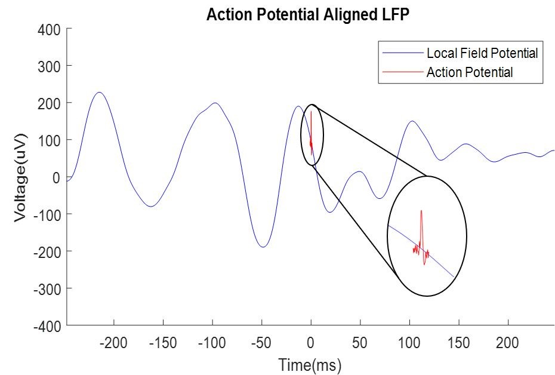
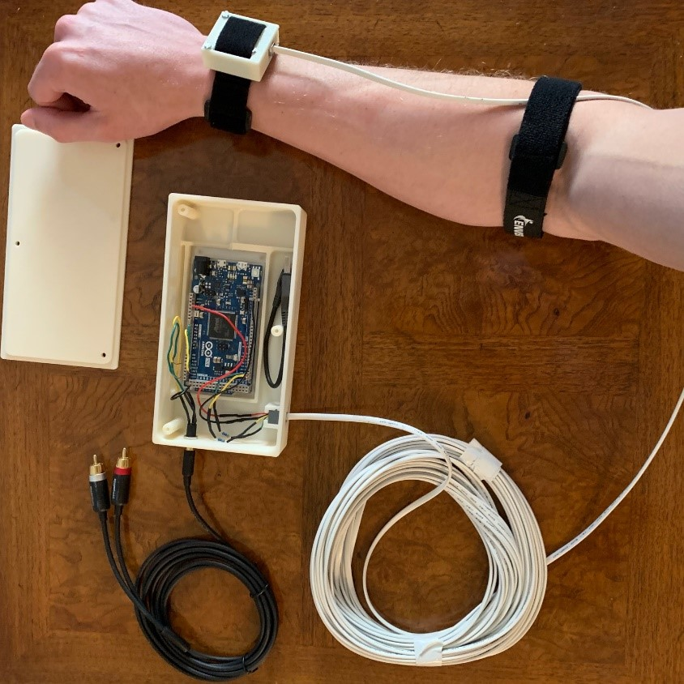

# DBS Study

Analyzing neural activity to understand the mechanisms of deep brain 
stimulation (DBS) for Parkinson's disease. 

The data was collected using a microelectrode and a micro-ECoG grid. 
Data can be accessed in the form of .mat files by clicking the link below: 

[**Bradley's DBS Data Link**](https://1drv.ms/f/s!AjcR-XWwXNN3k5xEzUF_UxYkR78HrQ) 

[**Dakota's DBS Data Link**](https://1drv.ms/u/s!Ajs685RmLE0XhDvQmE_BxL_BCtV3?e=2SvAeO)

**Figures:**

