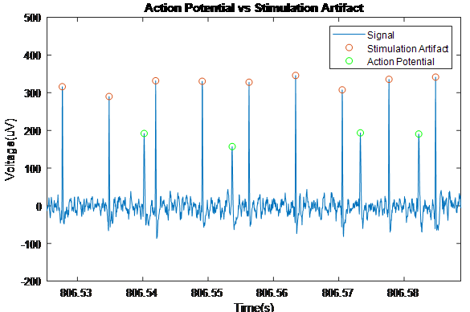

# DBS Study

## Goal: 
### Elucidate the physiological mechanisms by which deep brain stimulation (DBS) is providing benefit to patients with Parkinson's disease. 

## Procedures:
### Record neural activity from patients with Parkinson's disease 
  - Recording method: microelectrode inserted to subthalamic nucleus (STN) + micro-ECoG grid near/on premotor cortex 
  - Brain states & intervals: baseline (3min), stimulation ON (10sec), stimulation OFF (10sec)
  - Patient state: during implantation of DBS system while under general anesthesia 
### Analyze recordings in MATLAB
1. Remove stimulation artifacts from signal 
2. Highpass filter singal & obtain action potential locations 
3. Sort action potentals using principal component analysis 
4. Lowpass filter raw singal and use action potential locations to generate action potential aligned local field potential (LFP) (otherwise known as spike triggered averages)
5. Perform spectral analysis on these spike triggered averages to identify variations in signal composition 

### Interpret results
- Journal publication currently being prepared for Society of Neuroscience

## Figures:

### Stimulation & Recording Paradigm 

### Example of STN Neuron Burst Firing 

### Zoomed in Burst Firing

### Comparing Action Potentials to Stimulation Artifacts 

### Action Potential Aligned LFP

